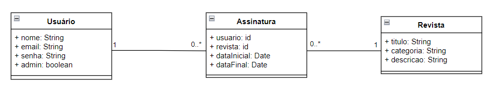

<div align="center">


[](https://github.com/ServeRest/ServeRest/)

</div>

## 💬 Sobre

Este é o repositório para o Projeto 2 da disciplina de Programação Web Back End. O objetivo do Projeto 2 é aplicar conhecimentos sobre APIs REST, como construir uma API com a ferramenta Swagger para gerar documentação, a conexão com um Banco de Dados, a execução de comandos por rotas sem uma interface gráfica e o uso de parâmetros em rotas ou corpo de requisições para interagir com os dados armazenados no Banco de Dados.

O sistema desenvolvido simula um sistema de assinatura de revistas, onde Usuários podem realizar e verificar suas Assinaturas.

Os relacionamentos entre Usuários, Assinaturas e Revistas está descrito no diagrama a seguir:

<div align="center">



- Um Usuário pode ter nenhuma, uma ou várias Assinaturas;
- Uma Revista pode estar em nenhuma, uma ou várias Assinaturas;
- Uma Assinatura só está ligada a um Usuário;
- Uma Assinatura só está ligada a uma Revista.

</div>

## 🔧 Estrutura

O código do projeto está estruturado em diretórios e arquivos separados de modo a agrupar códigos de propósitos semelhante. Está organizado da seguinte forma:

- **controllers**: Diretório para os arquivos controladores dos modelos e do sistema de autenticação;
- **inputValidadores**: Diretório com modelos e implementação de validadores;
- **middlewares**: Diretório para os middlewares utilizados nas rotas;
- **models**: Diretório com os modelos Joi das classes que compõem o sistema;
- **mongo**: Diretório para o arquivo de conexão com o banco de dados;
- **routes**: Diretório para o arquivo com as rotas da API;
- ***.env.example***: Arquivo exemplo de ambiente, com as chaves que devem ser configuradas;
- ***app.js***: Arquivo principal da API, faz e verifica a conexão com o Banco de Dados, instancia as rotas, utiliza o arquivo de configurações de ambiente, e inicia o servidor na porta definida no mesmo arquivo (padrão 3000);
- ***swagger.js***: Arquivo de definição da documentação Swagger, define as tags que serão utilizadas.

## 📝 Configuração

Para verificar o funcionamento do projeto, é preciso criar um arquivo de configurações de ambiente (.env).

O arquivo ***.env.example*** apresenta as chaves que devem ter valores adicionados:

```
DB_CLUSTER=
DB_USERNAME=
DB_PASSWORD=
APPNAME=
SECRET=
EXPIRE=
```

As chaves `DB_...` devem ser preenchidas com as informações respectivas do banco de dados MongoDB criado.

As demais chaves são:

- `APPNAME`: um identificador da aplicação;
- `SECRET`: Uma chave secreta para propósitos de segurança, como geração de tokens e criptografia;
- `EXPIRE`: Define o tempo de duração de tokens.

Será preciso ainda executar a instalação dos pacotes utilizados pelo projeto.
Para fazer isso, execute o comando no diretório em que descompactar este repositório:

`npm install`

Isso criará o diretório node_modules em seu diretório.

Para executar o projeto, execute o comando:

`npm start`

Com o projeto executando, é possível visualizar seu funcionamento por meio de ferramentas como Postman, ou a extensão ThunderClient no VSCode. A documentação Swagger pode ser acessada pela rota `localhost:3000/api-doc/#/` para consultar o funcionamento das rotas, parâmetros necessários e respostas possíveis.

Caso queira alterar a documentação Swagger, para aplicar as alterações é preciso parar a execução da aplicação, executar o comando:

`npm run swagger-autogen`

E depois iniciar a aplicação novamente.
